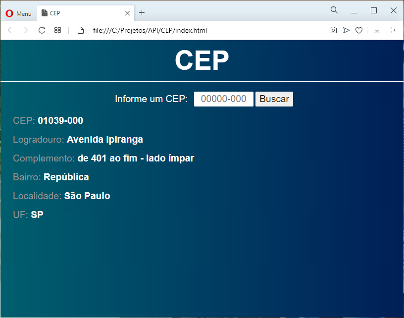

# API VIA CEP




É um [**webservice**](https://viacep.com.br) gratuito e muito simples de usar, enviamos um **cep** através de uma **url** e recebemos o **endereço** correspondente no formato desejado: "**json**", "**xml**", "**piped**" ou "**querty**".

*Exemplo*:

https://viacep.com.br/ws/01001000/json/

```json
{
  "cep": "01039-000",
  "logradouro": "Avenida Ipiranga",
  "complemento": "de 401 ao fim - lado ímpar",
  "bairro": "República",
  "localidade": "São Paulo",
  "uf": "SP",
  "ibge": "3550308",
  "gia": "1004",
  "ddd": "11",
  "siafi": "7107"
}
```


